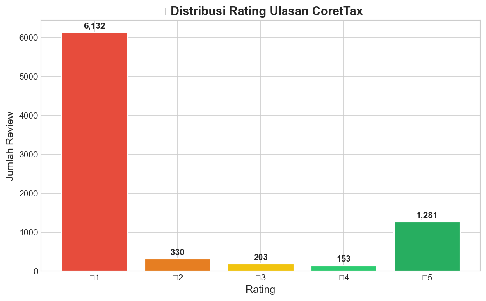
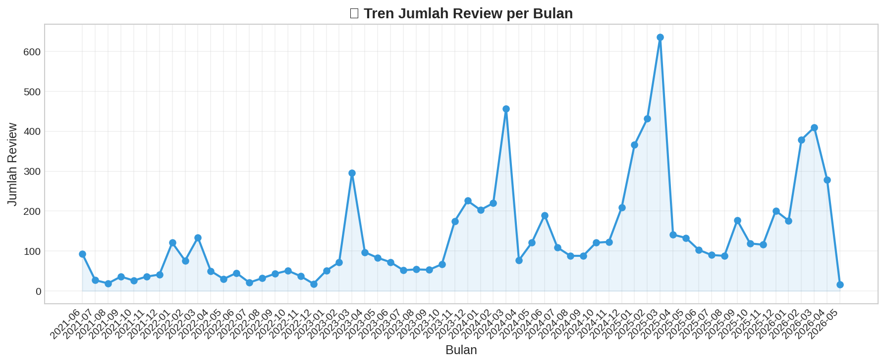
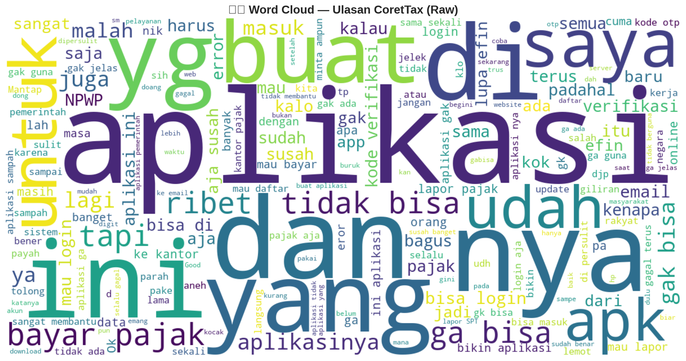
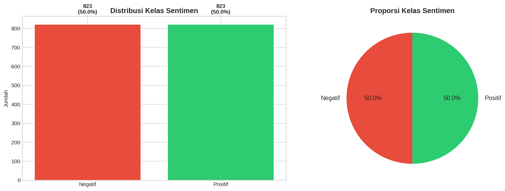
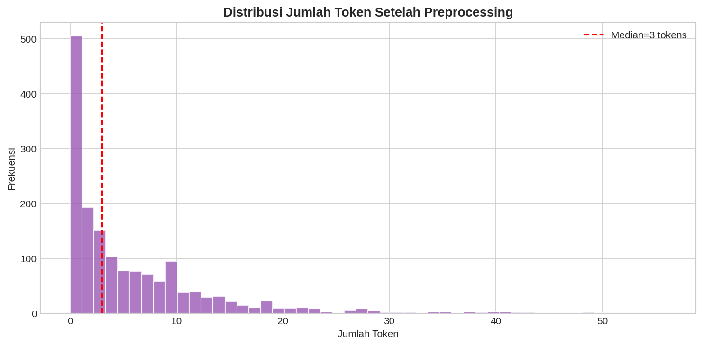
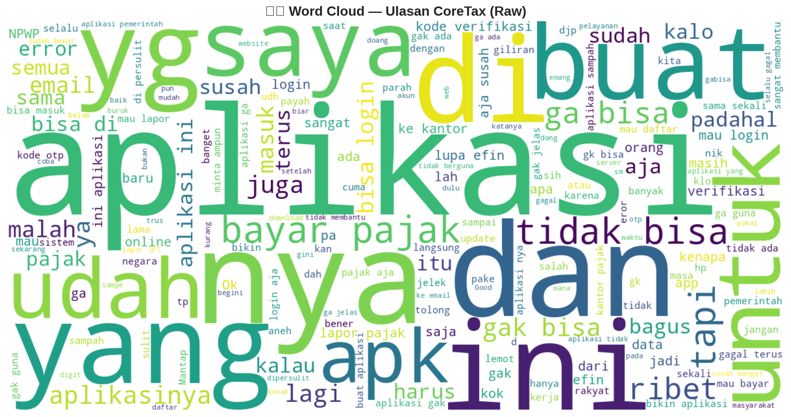
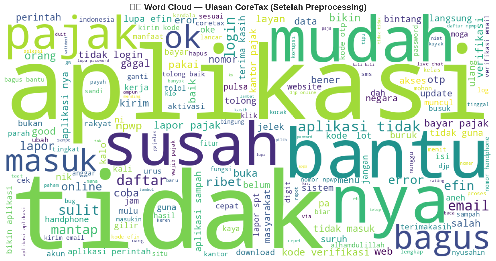

# Laporan Deep Analysis — Perbandingan Workflow Analisis Sentimen CoreTax (M-Pajak)

**Anggota Tim:**
- Titanio Yudista
- Ahmad Fauzan
- Yeni Nur Arwanti

Dokumen ini menyajikan analisis mendalam atas keseluruhan artefak project (notebook, modul `src/`, dataset, hasil eksperimen, dan visualisasi) dengan fokus utama pada perbandingan **Workflow Lama (Baseline / ternary)** vs **Workflow Baru (Optimized / binary)**.

> Catatan terminologi
> - **Old/Baseline**: workflow dengan 3 kelas (Negatif/Netral/Positif).
> - **New/Optimized**: workflow dengan 2 kelas (Negatif vs Positif) setelah drop rating 3.

---

## 1. Pendahuluan

Aplikasi CoreTax (M-Pajak) merupakan layanan publik digital yang intens digunakan masyarakat. Ulasan pengguna di Google Play Store menjadi sumber data berharga untuk memantau kepuasan serta mendeteksi isu teknis/UX secara cepat.

Namun, analisis sentimen pada ulasan aplikasi memiliki tantangan khas:

1. **Noise tinggi**: typo, slang, emoticon, repetisi, dan teks sangat pendek.
2. **Ambiguitas rating**: rating 3 sering “abu-abu” dan overlap dengan teks negatif/positif.
3. **Class imbalance** pada data mentah: rating 1 sangat dominan.
4. **Tujuan bisnis**: bukan sekadar akurasi, tetapi *insight* (topik keluhan, tren waktu, versi aplikasi bermasalah).

Project ini membangun pipeline modular untuk:
- menyiapkan dataset dari review mentah,
- melakukan preprocessing bahasa Indonesia (termasuk normalisasi slang dan stemming Sastrawi),
- mengekstraksi fitur (TF‑IDF dan embedding),
- melatih dan mengevaluasi beberapa model ML,
- serta melakukan interpretasi (topic modeling, tren temporal, dan sentimen per versi aplikasi).

---

## 2. Latar Belakang

### 2.1 Konteks masalah

Ulasan pengguna pada layanan publik cenderung berorientasi pada:
- kegagalan akses (login/OTP/EFIN),
- masalah verifikasi identitas (email/NIK/NPWP),
- performa (lemot/lag/error),
- alur layanan yang rumit (daftar, lapor, bayar).

Di sisi pemodelan, rating 1–5 sering dipakai sebagai label *proxy* sentimen. Ini praktis, tetapi menimbulkan masalah:

- **Rating 3**: teksnya bisa cenderung negatif (“lumayan tapi sering error”), atau positif (“oke lah”), sehingga menjadi kelas yang paling sulit dipisahkan.
- **Distribusi rating sangat timpang**: jika langsung dilatih tanpa balancing, model dapat bias dan metrik “accuracy” bisa menipu.

### 2.2 Gambaran pipeline di repo

Repo ini secara garis besar dibagi menjadi:

- **notebooks/**: eksekusi end-to-end dan pembuatan artefak (dataset final, tabel perbandingan, dan gambar).
- **src/**: modul produksi/reusable untuk preprocessing, feature extraction, training loop, evaluasi, dan topic modeling.
- **data/**: data mentah + data olahan + embedding.
- **results/**: tabel hasil eksperimen, feature matrices, dan visualisasi.
- **scripts/**: utilitas, terutama download embedding FastText (cc.id.300.vec).
- **reports/**: contoh laporan dan tool konversi markdown → docx.

---

## 3. Tujuan Penelitian

Tujuan utama laporan dan project ini adalah:

1. Membandingkan performa model analisis sentimen **sebelum** vs **sesudah** workflow di-adjust (ternary → binary).
2. Mengukur dampak perubahan pipeline: rentang waktu data, strategi labeling, noise filtering, preprocessing, dan balancing.
3. Menentukan kombinasi **feature extractor + model** terbaik dari sisi:
	- kualitas (accuracy, weighted F1, macro F1),
	- efisiensi (training time dan inference time).
4. Memberikan interpretasi yang actionable:
	- topik keluhan dominan (LDA),
	- tren sentimen per waktu,
	- distribusi sentimen per versi aplikasi.

---

## 4. Evolusi Strategi Workflow

Bagian ini merangkum perubahan dari workflow lama ke workflow baru.

### 4.1 Perbandingan teknis ringkas (Before vs After)

| Aspek | Workflow Lama (Baseline) | Workflow Baru (Optimized) |
|---|---|---|
| Notebook utama | `01_eda_and_preparation.ipynb` s/d `05_comparison_analysis.ipynb` | `01.1_eda_and_preparation.ipynb` s/d `05.5_comparison_analysis.ipynb` |
| Rentang waktu dominan dataset final | 2021‑06 s/d 2026‑04 | 2024‑01 s/d 2026‑05 |
| Labeling | 3 kelas: (1–2), 3, (4–5) | 2 kelas: (1–2) vs (4–5) |
| Kelas “Netral” | Dipertahankan | Drop (rating 3 tidak dipakai) |
| Noise filtering | Tidak fokus ke panjang ulasan pada tahap final | Ditargetkan min 3 token (tujuan desain) |
| Preprocessing | Basic → menjadi lebih kuat lewat modul `src/preprocessing.py` | Advanced + normalisasi slang + stemming Sastrawi |
| Balancing | Dataset final dibuat seimbang (609 baris) namun tetap 3 kelas | Dataset final dibuat seimbang (1,646 baris) untuk 2 kelas |
| Hasil puncak | Weighted F1 ~ 0.681 (FastText + XGBoost) | Weighted F1 ~ 0.906 (TF‑IDF + Logistic Regression) |

### 4.2 Inti “kenapa workflow baru jauh lebih baik”

1. **Menurunkan ambiguitas label** dengan menghapus kelas Netral (rating 3).
2. **Mempertajam sinyal**: dua kelas yang lebih “ekstrem” (1–2 vs 4–5) membuat boundary lebih jelas.
3. **Data lebih relevan**: fokus pada 2 tahun terakhir mengurangi drift (perubahan fitur/bug aplikasi di masa lampau).
4. **Preprocessing lebih konsisten**: normalisasi slang + stopword (preserve negasi) + stemming meningkatkan konsistensi token.
5. **Model sederhana menjadi kompetitif**: TF‑IDF + Logistic Regression menjadi sangat kuat dan efisien.

### 4.3 Audit komponen project (notebook, modul, dan artefak)

Bagian ini merangkum “peran” tiap komponen penting di repo, karena workflow di sini tidak hanya notebook—tetapi juga modul reusable.

**A. notebooks/**
- Berperan sebagai orkestrator end-to-end: EDA → labeling & preprocessing → feature engineering → training → analisis komparatif.
- Workflow lama vs baru dipisahkan lewat penamaan notebook (tanpa suffix vs dengan `.x` seperti `01` vs `01.1`).
- Notebook juga menghasilkan artefak visual pada `results/figures/**` (terlihat adanya pasangan file “old” vs “_new”).

**B. src/**
- `src/preprocessing.py`
	- Loader data mentah (`load_raw_data`) dan normalisasi ringan (`normalize_text_basic`).
	- Feature engineering untuk analisis (`word_count`, `char_count`, `year_month`, `is_duplicate`).
	- Full NLP preprocessing (`preprocess_text`, `preprocess_dataframe`) yang mencakup slang normalization, stopword removal (preserve negasi), dan stemming Sastrawi.
	- Labeling ternary berbasis rating (`add_sentiment_labels`).
- `src/feature_extractors.py`
	- Implementasi extractor modular (BaseExtractor) untuk TF‑IDF dan embedding (Word2Vec/FastText/GloVe) serta opsi transformer pada subset `all`.
	- Pada subset `priority`, extractor yang benar-benar dipakai tabel hasil adalah: TF‑IDF, Word2Vec, FastText, GloVe.
- `src/models.py`
	- Wrapper model yang konsisten (`ModelWrapper`) dengan hyperparameter tuning via `RandomizedSearchCV`.
	- Registry model `priority` yang dipakai di tabel hasil: Logistic Regression, Random Forest, XGBoost, Decision Tree.
- `src/experiment_runner.py`
	- Menjalankan kombinasi extractor × model (dengan caching fitur) dan menyimpan feature matrices ke `results/feature_matrices/`.
	- Menyimpan tabel perbandingan ke `results/comparison_table.csv` atau `results/comparison_table_new.csv`.
- `src/evaluator.py`
	- Menghitung metrik (accuracy, weighted/macro F1, ROC‑AUC jika memungkinkan), membuat plot perbandingan (quadrant), dan membuat comparison table.
- `src/topic_modeler.py`
	- Skrip LDA sederhana untuk mengekstrak topik dari ulasan Negatif.

**C. results/**
- `results/comparison_table*.csv`: ringkasan performa untuk baseline vs optimized.
- `results/feature_matrices/`: output matriks fitur (npz/npy) untuk reproducibility.
- `results/figures/`: aset visual EDA, evaluation, dan interpretation (tersedia versi “old” dan “_new”).

**D. scripts/**
- Fokus pada utilitas download embedding `cc.id.300.vec` untuk GloVe/FastText (lihat `scripts/download_cc_id_300_vec.py` dan dokumentasi `scripts/README.md`).

**E. reports/**
- Terdapat contoh laporan dan tool konversi `reports/markdown-to-word.py` untuk mengubah markdown menjadi DOCX (mengandalkan path gambar relatif dari file markdown).

---

## 5. Analisis Sumber Dataset

Bagian ini menjelaskan dataset yang tersedia dan dataset yang benar-benar dipakai dalam eksperimen (before vs after).

### 5.1 Dataset mentah (Raw)

- Lokasi: `./data/raw/coretax_reviews.csv`
- Link Lokasi disini: **[Lokasi File](https://github.com/Universitas-Cakrawala/final-project-txmg1/blob/main/data/raw/coretax_reviews.csv)**
- Jumlah baris: **8,102**
- Rentang tanggal: **2021‑06‑04** s/d **2026‑05‑05**

Distribusi rating pada data mentah (sangat timpang):

| Rating | Jumlah |
|---:|---:|
| 1 | 6,135 |
| 2 | 330 |
| 3 | 203 |
| 4 | 154 |
| 5 | 1,280 |

Visualisasi EDA (rating & volume review) tersedia di:

**Before**

**After**

Interpretasi awal:
- Rating 1 mendominasi, menunjukkan ketidakpuasan yang tinggi pada data mentah.
- Review volume fluktuatif, dan perubahan versi aplikasi berpotensi memicu lonjakan ulasan.

### 5.2 Dataset final untuk Workflow Lama (Baseline / ternary)

- Lokasi: `./data/processed/reviews_prepared.csv`
- Link Lokasi disini: **[Lokasi File](https://github.com/Universitas-Cakrawala/final-project-txmg1/blob/main/data/processed/reviews_prepared.csv)**
- Jumlah baris: **609**
- Rentang tanggal: **2021‑06‑05** s/d **2026‑04‑30**
- Distribusi sentimen (sudah seimbang): **203 Negatif, 203 Netral, 203 Positif**

Catatan penting:
- Walaupun data mentah timpang, dataset final baseline ini **dibuat seimbang** (kemungkinan sampling/undersampling) untuk membuat evaluasi lebih adil.
- Tetap saja, kelas Netral (rating 3) menyulitkan pemisahan kelas secara semantik.

Kualitas preprocessing (indikator praktis):
- `review_clean` kosong: **19** baris (3.12%)
- Panjang token `< 3`: **219** baris (35.96%)
- Duplicate text (flag `is_duplicate`): **103** baris (16.91%)

Visualisasi yang tersedia:

### 5.3 Dataset final untuk Workflow Baru (Optimized / binary)

- Lokasi: `./data/processed/reviews_prepared_new.csv`
- Link Lokasi disini: **[Lokasi File](https://github.com/Universitas-Cakrawala/final-project-txmg1/blob/main/data/processed/reviews_prepared_new.csv)**
- Jumlah baris: **1,646**
- Rentang tanggal: **2024‑01‑02** s/d **2026‑05‑03**
- Distribusi sentimen (seimbang): **823 Negatif, 823 Positif**
- Rating yang digunakan: **1, 2, 4, 5** (rating 3 tidak ada)

Kualitas preprocessing (indikator praktis):
- `review_clean` kosong: **38** baris (2.31%)
- Panjang token `< 3`: **698** baris (42.41%)
- Duplicate text (flag `is_duplicate`): **387** baris (23.51%)

Catatan penting tentang “noise filtering”:
- Secara desain workflow baru menargetkan **minimal 3 token**.
- Namun pada dataset final yang tersimpan, masih ada proporsi token `< 3` yang cukup besar.
- Interpretasi paling sederhana: filter minimal token kemungkinan diterapkan pada tahap lain (mis. sebelum full preprocessing) atau threshold dihitung dari kolom berbeda, sehingga setelah preprocessing masih ada teks menjadi sangat pendek/kosong.

Visualisasi yang tersedia:

---

## 6. Analisis Hasil Evaluasi

Bagian ini membandingkan hasil eksperimen model pada kedua workflow.

### 6.1 Artefak hasil yang digunakan

- Tabel perbandingan Old: `./results/comparison_table.csv`
- Tabel perbandingan New: `./results/comparison_table_new.csv`

Keduanya berisi 16 kombinasi (4 extractor × 4 model):

- Feature extractor (subset “priority”): TF‑IDF, Word2Vec, FastText, GloVe
- Model: Logistic Regression, Random Forest, XGBoost, Decision Tree

Catatan implementasi penting:
- Workflow New memakai `sentiment_encoded` bernilai `{0, 2}` (bukan `{0, 1}`), sehingga **ROC‑AUC tidak terhitung** pada tabel (kolom `roc_auc` menjadi kosong). Ini bukan masalah performa model, tetapi masalah encoding label untuk fungsi ROC‑AUC.

### 6.2 Ringkasan performa (Before vs After)

**Old (Baseline / ternary)**
- Rata-rata Weighted F1: **0.598**
- Best Weighted F1: **0.681** (FastText + XGBoost)
- Worst Weighted F1: **0.500** (TF‑IDF + Decision Tree)

**New (Optimized / binary)**
- Rata-rata Weighted F1: **0.877**
- Best Weighted F1: **0.906** (TF‑IDF + Logistic Regression)
- Worst Weighted F1: **0.818** (GloVe + Decision Tree)

Lonjakan ini konsisten dengan ringkasan di `SUMMARY.md`:
- Akurasi puncak old: ~68%
- Akurasi puncak new: ~90.6%

### 6.3 Top-5 kombinasi terbaik

**Top-5 Old (ternary)**

| Rank | Extractor | Model | Accuracy | Weighted F1 | Macro F1 | ROC-AUC | Train Time (s) |
|---:|---|---|---:|---:|---:|---:|---:|
| 1 | FastText | XGBoost | 0.680 | 0.681 | 0.681 | 0.797 | 312.28 |
| 2 | Word2Vec | Random Forest | 0.672 | 0.673 | 0.673 | 0.792 | 8.49 |
| 3 | FastText | Random Forest | 0.656 | 0.658 | 0.658 | 0.781 | 9.38 |
| 4 | FastText | Logistic Regression | 0.615 | 0.617 | 0.616 | 0.769 | 6.93 |
| 5 | GloVe | XGBoost | 0.615 | 0.616 | 0.616 | 0.769 | 795.29 |

**Top-5 New (binary)**

| Rank | Extractor | Model | Accuracy | Weighted F1 | Macro F1 | Train Time (s) |
|---:|---|---|---:|---:|---:|---:|
| 1 | TF‑IDF | Logistic Regression | 0.906 | 0.906 | 0.906 | 2.89 |
| 2 | Word2Vec | XGBoost | 0.903 | 0.903 | 0.903 | 123.53 |
| 3 | TF‑IDF | XGBoost | 0.903 | 0.903 | 0.903 | 5.94 |
| 4 | Word2Vec | Random Forest | 0.903 | 0.903 | 0.903 | 15.10 |
| 5 | TF‑IDF | Random Forest | 0.894 | 0.894 | 0.894 | 5.70 |

### 6.4 Visualisasi evaluasi

**Before**

**After**

Interpretasi utama:
- Pada workflow lama, sebagian besar kombinasi tertahan di bawah ~0.7 karena masalah multi-class (khususnya Netral).
- Pada workflow baru, banyak kombinasi berkumpul di “sweet spot” (F1 tinggi + waktu training rendah), khususnya TF‑IDF + Logistic Regression.

### 6.5 Analisis overfitting sederhana (workflow baru)

Skrip `../idea/check_overfitting.py` dijalankan pada dataset biner (TF‑IDF) untuk melihat gap train vs test accuracy:

| Model | Train Acc | Test Acc | Gap | Indikasi |
|---|---:|---:|---:|---|
| Logistic Regression | 0.935 | 0.903 | 0.032 | Tidak overfitting signifikan |
| Random Forest | 0.925 | 0.879 | 0.046 | Tidak overfitting signifikan |
| XGBoost | 0.915 | 0.885 | 0.030 | Tidak overfitting signifikan |
| Decision Tree | 0.976 | 0.861 | 0.115 | Overfitting |

Kesimpulan praktis:
- Model sederhana (LR) cenderung *generalize* lebih baik dan stabil.
- Decision Tree tunggal mudah overfit pada pola spurious.

---

## 7. Analisis Interpretasi dan Topic Modeling

Tujuan bagian ini: menjawab *“isu apa yang paling dominan dikeluhkan pengguna?”* bukan hanya *“akurasi berapa?”*.

### 7.1 Coherence-based topic selection (LDA)

**Before**

**After**

Interpretasi ringkas:
- Workflow lama cenderung menghasilkan topik yang lebih tumpang tindih karena kelas Netral dan sinyal campuran.
- Workflow baru memperjelas konteks negatif/positif sehingga topik keluhan lebih “tajam”.

### 7.2 Ringkasan topik (kata kunci dominan)

Ekstraksi topik sederhana (LDA) pada ulasan **Negatif** menghasilkan kata-kata kunci utama berikut.

**Workflow Lama (3 topik, Negatif)**
1. Login/verifikasi: *login, verifikasi, ribet, gagal, efin, masuk, password, kode*
2. Email/data/error: *email, data, pajak, buka, eror, web, perintah*
3. Lapor/bayar/daftar: *pajak, lapor, bayar, daftar, npwp, susah*

**Workflow Baru (7 topik, Negatif)**
1. Login/daftar/identitas: *login, gagal, daftar, verifikasi, efin, nik*
2. OTP/email: *kode, verifikasi, email, kirim, otp, pulsa*
3. Sistem & UX: *ribet, eror, sistem, password*
4. Akun & sandi: *sandi, aktivasi, lupa*
5. Lapor SPT & NPWP: *lapor, npwp, spt, bayar, kantor*
6. Web vs aplikasi: *web, perintah, login, bayar*
7. Kesulitan umum: *sulit, daftar, online, guna*

Interpretasi domain:
- Tema konsisten lintas workflow: **login/verifikasi/EFIN/NPWP**.
- Workflow baru memperkaya variasi isu (OTP, pulsa, aktivasi, sandi), menandakan topik lebih “granular”.

---

## 8. Analisis Temporal dan Sentimen Versi

Bagian ini fokus pada *kapan* dan *di versi mana* isu memuncak.

### 8.1 Analisis temporal (rating & proporsi negatif)

**Before**

**After**

Temuan data (workflow baru, proporsi negatif tertinggi dengan volume cukup):
- **2024‑06**: ~76.3% negatif (n=59)
- **2026‑01**: ~69.4% negatif (n=36)
- **2026‑03**: ~60.2% negatif (n=98)

Interpretasi:
- Lonjakan negatif yang konsisten pada bulan dengan jumlah review cukup besar lebih “actionable” untuk investigasi bug/incident dibanding puncak yang hanya muncul pada n kecil.

### 8.2 Distribusi sentimen per versi aplikasi

**Before**

**After**

Temuan data (workflow baru, versi dengan negatif tinggi, n≥20):

| Versi | n | Negatif | Negatif % |
|---|---:|---:|---:|
| 3.0.9 | 33 | 23 | 69.7% |
| 3.0.6 | 125 | 78 | 62.4% |
| 2.0.6 | 154 | 85 | 55.2% |
| 2.0.3 | 226 | 122 | 54.0% |
| 1.4.0 | 308 | 156 | 50.6% |

Interpretasi:
- Versi 3.x tampak lebih rentan pada keluhan (porsi negatif tinggi), terutama 3.0.9 dan 3.0.6.
- Versi dengan volume tinggi (mis. 1.4.0, 2.0.3) penting untuk diprioritaskan karena dampak user lebih luas.

---

## 9. Pembahasan

Bagian ini membedah “mengapa” hasil before/after demikian, ditinjau dari data, pipeline, dan model.

### 9.1 Dampak drop rating 3 (Netral)

**Masalah di workflow lama:**
- Kelas Netral secara semantik “menempel” ke negatif/positif.
- Banyak review rating 3 adalah keluhan ringan + pujian ringan (“lumayan, tapi…”) sehingga sulit.

**Efek di workflow baru:**
- Boundary klasifikasi menjadi lebih jelas.
- Model linear (Logistic Regression) sudah cukup kuat untuk memisahkan dua kelas yang lebih kontras.

### 9.2 Dampak fokus rentang waktu (2024–2026)

Keuntungan:
- Mengurangi *concept drift* (fitur/bug lama yang sudah tidak relevan).
- Lebih cocok untuk rekomendasi perbaikan saat ini.

Risiko:
- Bisa mengabaikan pola historis jangka panjang.
- Jika ingin evaluasi longitudinal, perlu dataset terpisah untuk analisis 2021–2023.

### 9.3 Dampak preprocessing & normalisasi bahasa

Modul `src/preprocessing.py` menyediakan pipeline yang lebih robust:

- normalisasi ringan (`normalize_text_basic`),
- engineered features (`word_count`, `char_count`, `year_month`, `is_duplicate`),
- normalisasi slang (`SLANG_DICT`),
- stopword removal dengan preservasi negasi,
- stemming Sastrawi.

Namun, dari statistik dataset final:
- masih ada `review_clean` kosong (2–3%),
- proporsi token `< 3` masih besar.

Ini mengindikasikan perlu konsistensi aturan filtering (kapan dan berdasarkan kolom apa filtering dilakukan).

### 9.4 Kenapa TF‑IDF + Logistic Regression menang di workflow baru

Hipotesis yang konsisten dengan hasil:
- Ulasan aplikasi banyak mengandung keyword yang kuat (login, otp, efin, npwp, error) sehingga representasi frekuensi (TF‑IDF) sangat efektif.
- Logistic Regression bekerja sangat baik pada fitur sparse TF‑IDF dan cenderung stabil (gap train-test kecil).
- Model boosting/forest bisa unggul pada beberapa setting, tetapi dengan biaya waktu lebih besar dan risiko kompleksitas.

### 9.5 Evaluasi ROC‑AUC pada workflow baru (catatan teknis)

Kolom ROC‑AUC pada `comparison_table_new.csv` kosong karena label yang dipakai adalah `{0,2}`. Secara praktis:
- ubah label Positif menjadi `1` (bukan `2`) untuk memudahkan perhitungan ROC‑AUC,
- atau set `pos_label=2` ketika memanggil `roc_auc_score`.

---

## 10. Kesimpulan

1. Workflow baru (binary, 2024–2026) memberikan peningkatan performa yang sangat besar dibanding workflow lama (ternary, 2021–2026).
2. Peningkatan utama berasal dari: **drop rating 3**, fokus waktu terbaru, preprocessing yang lebih rapi, dan balancing dataset.
3. Kombinasi terbaik berdasarkan artefak `results/comparison_table_new.csv` adalah **TF‑IDF + Logistic Regression** dengan:
	- Accuracy ≈ **0.906**
	- Weighted F1 ≈ **0.906**
	- Training time ≈ **2.89 detik**
4. Analisis interpretasi menunjukkan tema keluhan dominan tetap konsisten: **login, verifikasi/OTP, EFIN/NPWP, error sistem, dan kerumitan proses lapor/bayar**.
5. Analisis temporal & versi aplikasi membantu mengarahkan investigasi perbaikan ke bulan/versi yang paling bermasalah (mis. 2024‑06 dan versi 3.x tertentu).

---

## 11. Rekomendasi

### 11.1 Rekomendasi teknis pipeline

1. **Standarisasi label biner menjadi `{0,1}`** untuk memudahkan ROC‑AUC, confusion matrix, dan interpretasi umum.
2. Terapkan **filter minimal token setelah full preprocessing** (berdasarkan `review_clean`) agar review kosong/terlalu pendek tidak masuk training.
3. Pertimbangkan **deduplikasi** (atau minimal batasi porsi duplikat) pada tahap sampling/balancing agar model tidak “belajar dari teks yang sama”.
4. Tambahkan evaluasi yang lebih konsisten:
	- confusion matrix tersimpan (png),
	- per-class precision/recall,
	- ROC‑AUC untuk biner setelah label diperbaiki.

### 11.2 Rekomendasi eksperimen model

1. Uji extractor yang sudah tersedia di kode namun belum masuk tabel hasil (subset `all`), seperti:
	- TF‑IDF (Char+Word),
	- BM25,
	- IndoBERT/DistilBERT.
2. Lakukan ablation study sederhana:
	- tanpa stemming vs dengan stemming,
	- tanpa slang normalization vs dengan normalization,
	- window waktu (2024–2026) vs (2021–2026) pada setting biner.

### 11.3 Rekomendasi insight untuk pengembang

1. Prioritaskan perbaikan flow **login/verifikasi/OTP/EFIN** karena tema ini konsisten muncul sebagai topik negatif.
2. Monitoring rilis versi 3.x: proporsi negatif tinggi pada beberapa versi; gunakan dashboard sederhana berdasarkan `app_version` dan `year_month`.
3. Buat analisis lanjutan berbasis aspek (ABSA) untuk mengelompokkan keluhan ke aspek: akses, performa, fitur, UI/UX, layanan.

---

## 12. Penutup

Project ini sudah memiliki fondasi pipeline yang solid dan modular (via `src/`) serta artefak hasil yang lengkap (tabel + gambar before/after). Perubahan workflow dari ternary ke binary terbukti meningkatkan performa dan kualitas insight secara signifikan. Dengan sedikit perbaikan teknis (label encoding, filtering pasca-preprocessing, dan evaluasi ROC‑AUC), pipeline akan menjadi lebih konsisten, mudah direproduksi, dan lebih siap digunakan sebagai alat monitoring kualitas layanan CoreTax.

