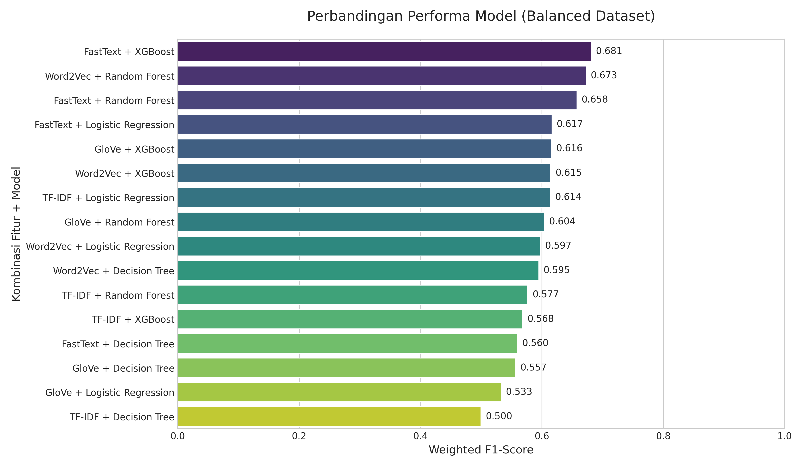
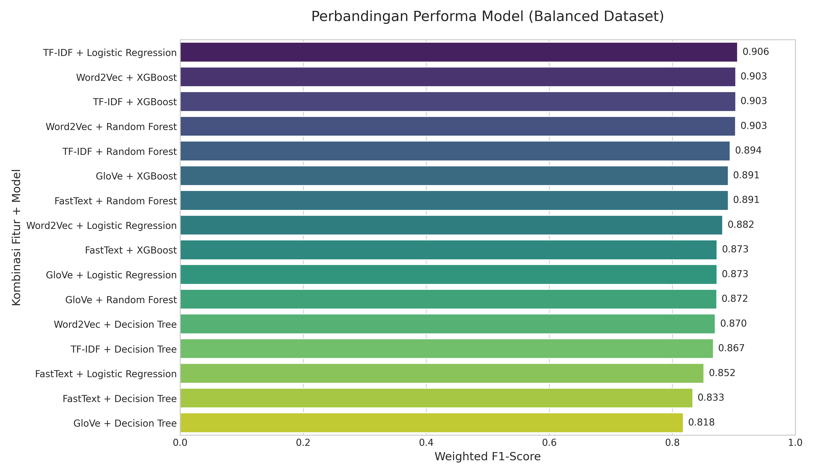
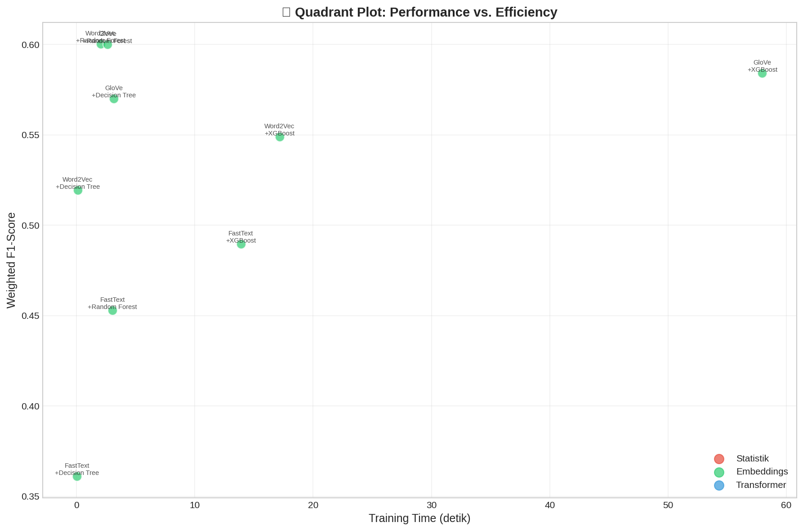
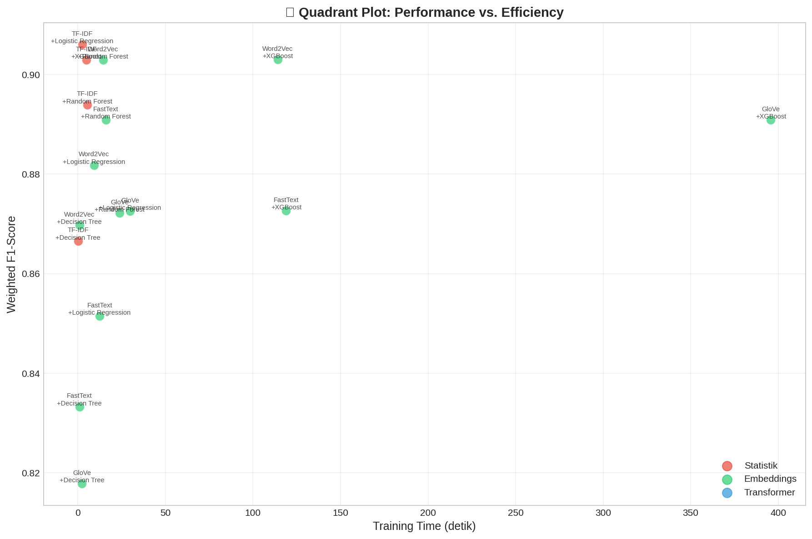
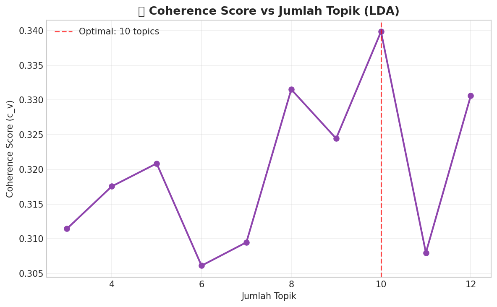
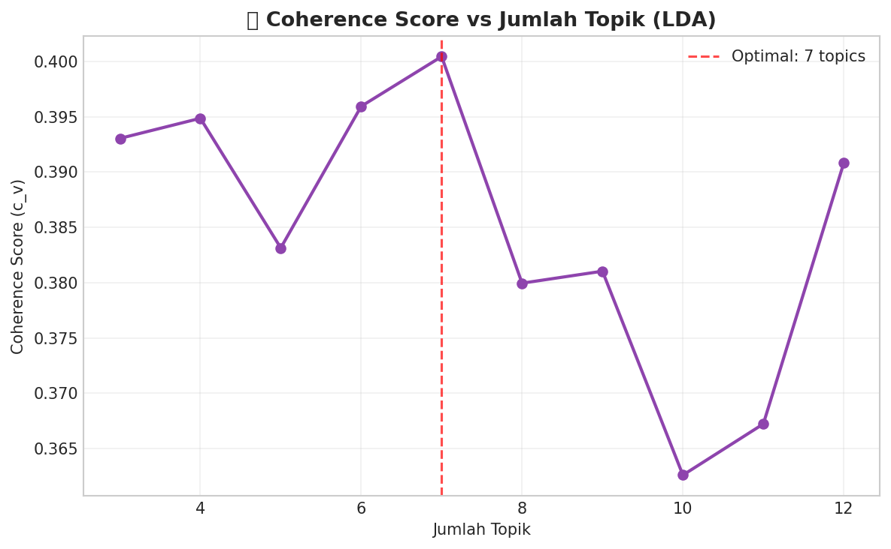
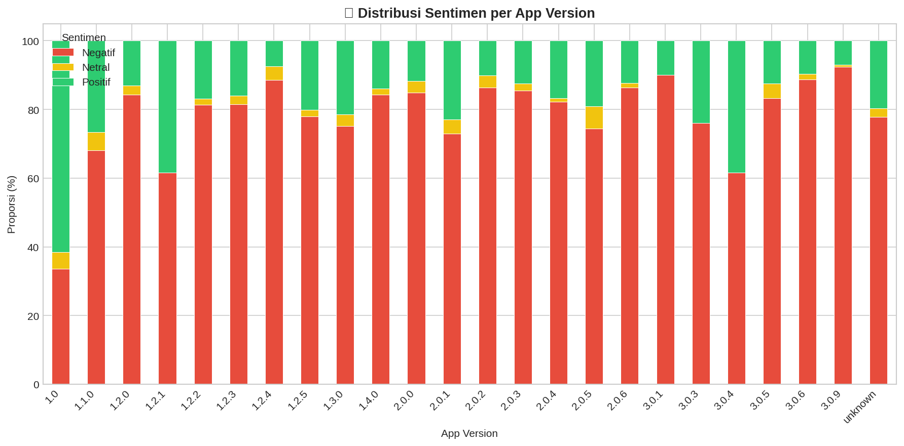
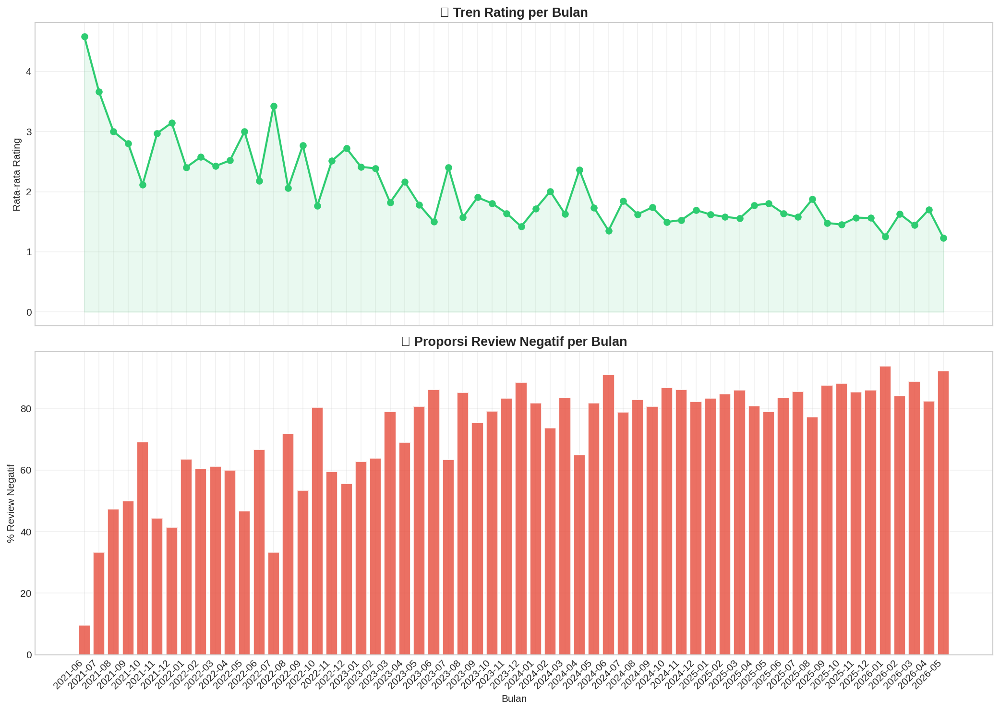
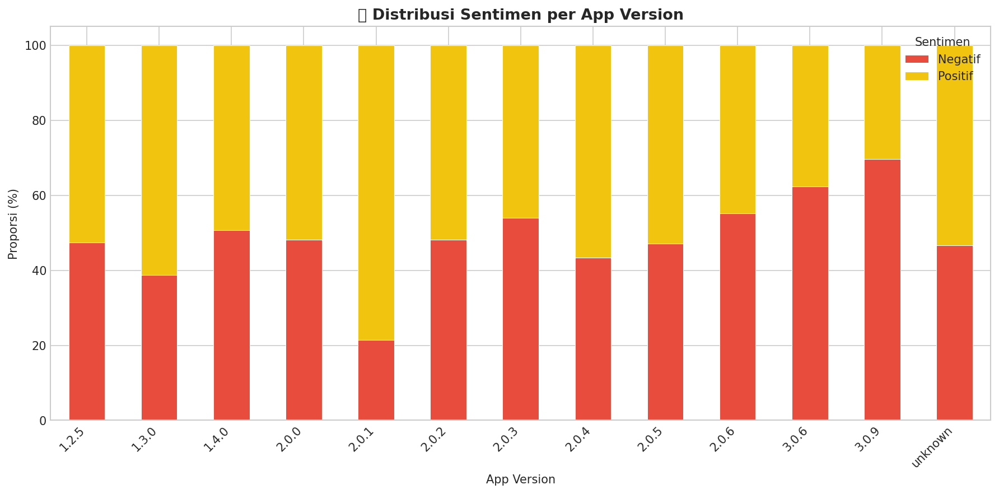
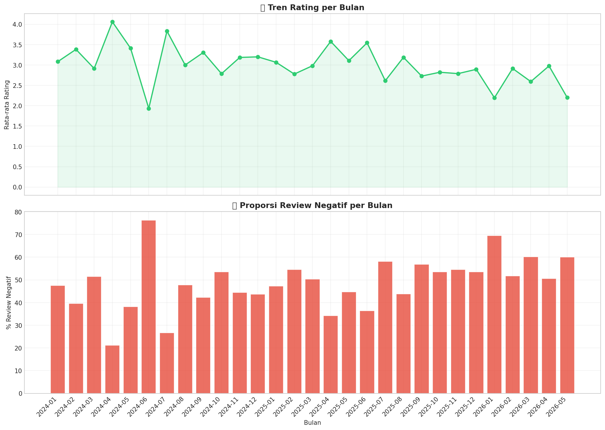

# 📊 Deep Analysis: Perbandingan Workflow Analisis Sentimen CoreTax

Dokumen ini menyajikan analisis mendalam mengenai evolusi sistem klasifikasi sentimen untuk aplikasi CoreTax/M-Pajak, membandingkan sistem baseline (**Old Workflow**) dengan sistem yang telah dioptimasi (**New Workflow**).

## 1. Evolusi Strategi Workflow

Peralihan dari Workflow lama ke baru bukan hanya sekadar penggantian model, melainkan perombakan total pada pipa pemrosesan data (data pipeline).

### 🔄 Perbandingan Teknis

| Fitur                     | Workflow Lama (Baseline)                                            | Workflow Baru (Optimized)                                               |
| :------------------------ | :------------------------------------------------------------------ | :---------------------------------------------------------------------- |
| **Notebooks**       | `01_eda_and_preparation.ipynb` - `05_comparison_analysis.ipynb` | `01.1_eda_and_preparation.ipynb` - `05.5_comparison_analysis.ipynb` |
| **Rentang Waktu**   | 2021 - 2026                                                         | **2024 - 2026** (2 Tahun Terakhir)                                |
| **Labeling**        | 3 Kelas (Rating 1-5)                                                | **2 Kelas** (Rating 1-2 & 4-5)                                    |
| **Noise Filtering** | Tanpa filter panjang ulasan                                         | **Minimal 3 Token**                                               |
| **Preprocessing**   | Basic cleaning                                                      | Advanced cleaning + Sastrawi Stemming                                   |
| **Dataset State**   | Unbalanced (Dominan Negatif)                                        | **Balanced** (Strategi Resampling)                                |

---

## 2. Analisis Sumber Dataset (Dataset Source)

Salah satu faktor kunci keberhasilan **Workflow Baru** adalah penyempurnaan pada pemilihan dan pembersihan dataset. Berikut adalah perbedaan mendasar antara kedua dataset yang digunakan:

### 📂 Dataset Workflow Lama (Baseline)

- **Path:** [`data/processed/reviews_prepared.csv`](file://data/processed/reviews_prepared.csv)
- **Cakupan Data:** Mengambil seluruh riwayat ulasan dari tahun **2021 hingga 2026**.
- **Karakteristik:** Dataset ini masih mempertahankan rating **Netral (Rating 3)**. Keberadaan data netral ini terbukti menjadi "noise" yang signifikan karena ambiguitas kata yang tumpang tindih antara ulasan positif dan negatif, sehingga akurasi model sulit menembus angka 70%.

### 📂 Dataset Workflow Baru (Optimized)

- **Path:** [`data/processed/reviews_prepared_new.csv`](file://data/processed/reviews_prepared_new.csv)
- **Cakupan Data:** Difokuskan pada data **2 tahun terakhir (2024 - 2026)**.
- **Karakteristik:** Dilakukan strategi **Drop Rating Netral (3)** u ntuk mempertajam perbedaan antara sentimen positif dan negatif. Selain itu, dataset ini telah diseimbangkan (balanced) agar model tidak bias terhadap satu kelas tertentu. Pemilihan data terbaru (2024-2026) juga memastikan model lebih relevan dengan kondisi aplikasi saat ini.

---

## 3. Analisis Hasil Evaluasi

Workflow baru menunjukkan lompatan performa yang signifikan, memvalidasi bahwa penghapusan kelas "Netral" (Rating 3) sangat krusial untuk akurasi model.

### 📈 Metrik Performa Utama

- **Workflow Lama:** Akurasi puncak **68.0%** (FastText + XGBoost).
- **Workflow Baru:** Akurasi puncak **90.6%** (TF-IDF + Logistic Regression).

### 🖼️ Visualisasi Evaluasi

Perhatikan perbedaan distribusi skor F1 antara kedua workflow di bawah ini:

#### A. Grouped Bar Chart (Performa Model)

Komparasi performa setiap kombinasi Feature Extractor dan Model.

*Gambar 1: Workflow Lama - Mayoritas model tertahan di angka 60%.*

*Gambar 2: Workflow Baru - Peningkatan drastis, mayoritas model melampaui 85%.*

#### B. Quadrant Analysis (F1 vs Time)

Melihat efisiensi model (Akurasi vs Kecepatan Training).

*Gambar 3 & 4: Workflow baru menunjukkan efisiensi tinggi pada Logistic Regression (F1 tinggi, waktu singkat).*

---

## 4. Analisis Interpretasi & Topic Modeling

Selain akurasi, interpretasi terhadap apa yang dibicarakan pengguna juga mengalami perubahan kualitas.

### 🧠 Topic Modeling (LDA)

Kami menggunakan metrik **Coherence Score** untuk menentukan jumlah topik optimal.

### Old Workflow

### New Workflow

*Gambar 5 & 6: Workflow baru memberikan skor koherensi yang lebih stabil, memudahkan penentuan topik keluhan pengguna.*

### 🕒 Analisis Temporal & Sentimen Versi

Melihat bagaimana sentimen berubah seiring waktu dan update versi aplikasi.

#### Old Workflow (Ternary)

#### New Workflow (Binary)

*Gambar 7 - 10: Distribusi sentimen pada Workflow Baru memberikan gambaran yang lebih kontras dan jelas antara kepuasan dan keluhan pengguna dibandingkan workflow lama yang memiliki banyak noise dari kelas Netral.*

---

## 5. Kesimpulan Akhir

Berdasarkan analisis di atas:

1. **Workflow Baru (`_new`)** adalah pemenang mutlak dengan akurasi **90.6%**.
2. **TF-IDF + Logistic Regression** adalah kombinasi paling direkomendasikan karena mencapai akurasi tertinggi dengan waktu komputasi yang sangat efisien.
3. Penyebab utama rendahnya akurasi pada workflow lama adalah **Rating 3 (Netral)** yang bersifat ambigu, di mana teks ulasannya seringkali memiliki nada yang sama dengan ulasan negatif (misal: "Aplikasi lambat tapi oke lah").

---

**Text Mining Project — Universitas Cakrawala**
