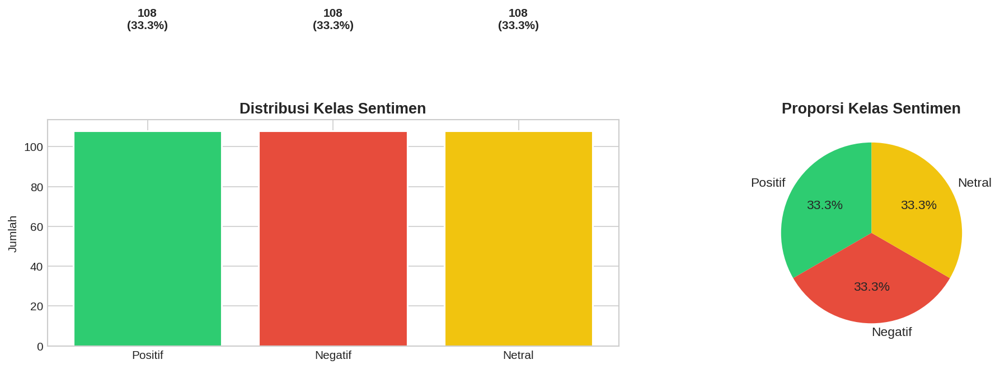
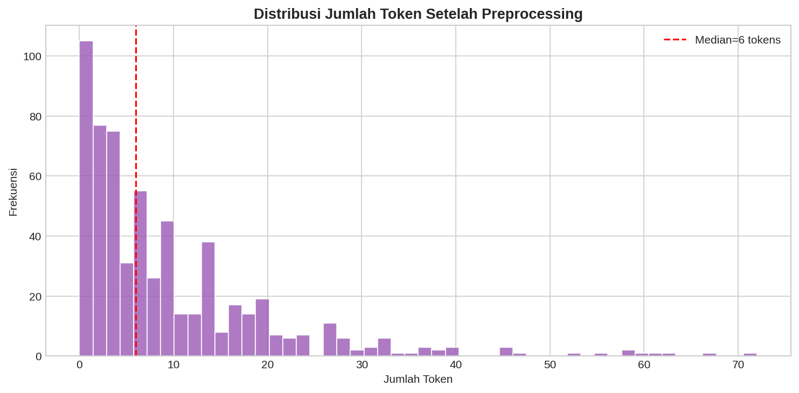
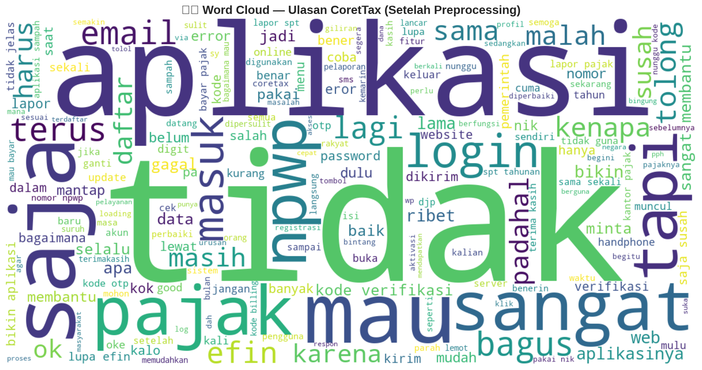

# Perbandingan Word Embeddings dan Machine Learning untuk Analisis Sentimen Masyarakat terhadap Aplikasi CoreTax (M-Pajak) pada Google Play Store

**ABSTRAK**

Aplikasi M-Pajak (CoreTax) merupakan platform digital resmi Direktorat Jenderal Pajak yang ditujukan untuk memudahkan layanan perpajakan bagi masyarakat Indonesia. Ulasan pengguna pada Google Play Store dapat dimanfaatkan sebagai sumber data untuk mengukur persepsi publik terhadap kualitas layanan aplikasi. Penelitian ini menerapkan pendekatan *text mining* untuk klasifikasi sentimen tiga kelas, yaitu Positif, Netral, dan Negatif, dengan fokus pada perbandingan beberapa metode *word embedding* dan algoritma *machine learning*. Dataset akhir yang digunakan pada eksperimen terbaru berjumlah 609 ulasan yang telah diseimbangkan, masing-masing 203 ulasan untuk setiap kelas. Hasil eksperimen menunjukkan bahwa kombinasi **GloVe + XGBoost** memberikan performa terbaik dengan nilai **Weighted F1-Score 71,45%**, **Macro F1-Score 71,44%**, **akurasi 71,31%**, dan **ROC-AUC 0,8560**. Selain itu, analisis LDA menunjukkan bahwa keluhan pengguna didominasi oleh isu verifikasi, login, kerumitan proses, dan hambatan pendaftaran. Hasil ini menunjukkan bahwa representasi semantik berbasis embedding masih relevan untuk analisis sentimen layanan publik, terutama ketika evaluasi dilakukan pada dataset yang sudah diseimbangkan.

**Kata Kunci**: Analisis Sentimen, CoreTax, GloVe, Word2Vec, FastText, XGBoost, LDA, Text Mining

---

## I. PENDAHULUAN

Di era digital, aplikasi mobile menjadi jembatan utama antara pemerintah dan masyarakat. Direktorat Jenderal Pajak merilis aplikasi M-Pajak (CoreTax) untuk meningkatkan efisiensi pelaporan pajak. Namun, akumulasi ulasan di Google Play Store menunjukkan adanya disparitas pengalaman pengguna. Analisis sentimen manual terhadap ribuan data menjadi tidak efisien, sehingga diperlukan pendekatan *text mining* otomatis. Penelitian ini bertujuan untuk membandingkan representasi fitur berbasis embedding dan model *machine learning* untuk memperoleh model klasifikasi sentimen yang paling efektif, sekaligus mengidentifikasi isu utama yang paling sering dikeluhkan pengguna.

## II. STUDI LITERATUR

### Text Mining dan Preprocessing

*Text mining* adalah proses ekstraksi informasi berguna dari data teks tidak terstruktur. Tahapan penting yang digunakan dalam penelitian ini meliputi *case folding*, *noise removal*, *stopword removal*, *tokenizing*, dan *stemming* menggunakan Sastrawi agar teks ulasan menjadi lebih bersih dan konsisten.

### Word Embeddings

Berbeda dengan TF-IDF yang menitikberatkan pada frekuensi kemunculan kata, *word embeddings* memetakan kata ke dalam representasi vektor numerik yang mampu menangkap kedekatan makna. Pada penelitian ini, fitur yang dibandingkan adalah **GloVe**, **Word2Vec**, dan **FastText**.

### Machine Learning untuk Klasifikasi Sentimen

Algoritma *machine learning* yang digunakan adalah **Decision Tree**, **Random Forest**, dan **XGBoost**. Ketiga model tersebut dipilih karena mewakili model pohon keputusan tunggal, *ensemble bagging*, dan *gradient boosting* yang umum digunakan pada tugas klasifikasi teks.

## III. METODE

Penelitian ini menggunakan alur sistematis sebagai berikut:

1. **Pengumpulan Data**: Mengambil ulasan aplikasi CoreTax dari Google Play Store.
2. **Pelabelan Sentimen**: Mengubah rating menjadi tiga kelas sentimen, yaitu Negatif, Netral, dan Positif.
3. **Preprocessing Teks**: Melakukan normalisasi teks melalui pembersihan, tokenisasi, dan stemming.
4. **Penyeimbangan Data**: Menyiapkan dataset akhir seimbang sebanyak 609 ulasan, terdiri atas 203 data per kelas.
5. **Ekstraksi Fitur**: Mengubah teks menjadi representasi vektor menggunakan GloVe, Word2Vec, dan FastText.
6. **Pelatihan Model**: Menguji kombinasi fitur dan model untuk memperoleh performa terbaik.
7. **Evaluasi dan Analisis Domain**: Menggunakan metrik akurasi, Weighted F1, Macro F1, ROC-AUC, analisis topik LDA, dan analisis temporal.

*Gambar 1. Distribusi kelas sentimen pada dataset akhir yang digunakan dalam eksperimen.*

---

## BAB IV
## HASIL DAN PEMBAHASAN

### A. Hasil Preprocessing Data

Setelah melalui tahapan preprocessing yang meliputi *case folding*, *noise removal*, *stopword removal*, *tokenizing*, dan *stemming* menggunakan Sastrawi, diperoleh data teks yang lebih bersih dan lebih siap untuk diekstraksi menjadi fitur numerik. Pada artefak dataset terbaru, file `reviews_prepared.csv` berisi **609 ulasan** dan seluruh kelas telah berada pada kondisi seimbang, yaitu masing-masing **203 ulasan** untuk sentimen Negatif, Netral, dan Positif.

Beberapa hasil preprocessing yang diperoleh adalah sebagai berikut:

- Rata-rata jumlah token per ulasan: **8,96 token**
- Median jumlah token per ulasan: **5 token**
- Vocabulary hasil preprocessing: **1.527 kata unik**
- Data kosong setelah preprocessing: **5 baris**

Contoh hasil preprocessing:

- Sebelum: "Aplikasinya bikin bingung gak satset. Log in salah terus padahal udah sesuai."
- Sesudah: "aplikasinya bikin bingung tidak satset log in salah terus padahal sesuai"

Tahapan preprocessing ini terbukti mampu mengurangi *noise*, menyeragamkan bentuk kata, dan mempertahankan informasi penting yang relevan untuk proses klasifikasi sentimen.

*Gambar 2. Distribusi jumlah token setelah preprocessing.*

*Gambar 3. Wordcloud dari ulasan yang telah dipreprocessing.*

### B. Hasil Eksperimen Model

Penelitian ini menguji beberapa kombinasi metode *feature extraction* dan algoritma *machine learning* pada dataset seimbang. Berdasarkan hasil eksperimen final yang digunakan pada analisis komparatif, tiga kombinasi terbaik ditunjukkan pada tabel berikut:

| Feature Extraction | Model | Accuracy | Weighted F1 | Macro F1 | ROC-AUC |
|---|---|---:|---:|---:|---:|
| GloVe | XGBoost | 71,31% | 0,7145 | 0,7144 | 0,8560 |
| GloVe | Random Forest | 69,67% | 0,7002 | 0,6999 | 0,8479 |
| Word2Vec | XGBoost | 63,93% | 0,6413 | 0,6413 | 0,7989 |

Dari hasil tersebut, kombinasi **GloVe + XGBoost** memberikan performa terbaik. Selisih antara Weighted F1 dan Macro F1 pada model terbaik juga sangat kecil, sehingga menunjukkan bahwa performa model relatif seimbang di seluruh kelas sentimen.

*Gambar 4. Perbandingan Weighted F1-Score antar kombinasi fitur dan model.*

*Gambar 5. Quadrant plot antara performa model dan waktu pelatihan.*

### C. Analisis Perbandingan Model

Berdasarkan hasil eksperimen, beberapa temuan penting adalah sebagai berikut:

- **GloVe** menjadi representasi fitur terbaik pada eksperimen terbaru karena memberikan nilai Weighted F1 dan Macro F1 tertinggi.
- **XGBoost** merupakan model dengan performa tertinggi pada kombinasi terbaik, walaupun membutuhkan waktu pelatihan lebih besar dibandingkan Decision Tree dan Random Forest.
- **Random Forest** menunjukkan performa yang stabil, khususnya ketika dipadukan dengan GloVe, meskipun masih berada di bawah XGBoost.
- **Word2Vec** tetap kompetitif, tetapi belum mampu melampaui GloVe pada konfigurasi akhir yang digunakan.
- **FastText** menghasilkan performa paling rendah pada eksperimen ini, sehingga kurang optimal untuk dataset dan konfigurasi model yang digunakan.

Hal ini menunjukkan bahwa representasi semantik berbasis ko-occurence global seperti GloVe lebih efektif dalam menangkap pola sentimen ulasan CoreTax dibandingkan embedding lain pada konfigurasi eksperimen terbaru.

### D. Analisis Class Imbalance

Pada artefak eksperimen terbaru yang tersimpan di repositori, penanganan *class imbalance* sudah diterapkan pada tahap pembentukan dataset akhir. Hal ini terlihat dari distribusi kelas yang seimbang, yaitu **203 Negatif**, **203 Netral**, dan **203 Positif**. Dengan demikian, evaluasi model tidak lagi bias ke kelas mayoritas.

Temuan utama dari kondisi dataset seimbang ini adalah sebagai berikut:

- Nilai Weighted F1 dan Macro F1 pada model terbaik hampir identik, yaitu **0,7145** dan **0,7144**.
- Kedekatan kedua metrik tersebut menunjukkan bahwa model terbaik tidak hanya baik secara keseluruhan, tetapi juga relatif konsisten di seluruh kelas.
- Evaluasi pada dataset seimbang membuat interpretasi performa menjadi lebih adil karena kelas minoritas tidak lagi tertekan oleh dominasi kelas tertentu.

Dengan demikian, pada versi hasil terbaru, pembahasan *class imbalance* lebih tepat difokuskan pada keberhasilan penyusunan dataset seimbang sebagai dasar evaluasi yang lebih kredibel.

### E. Confusion Matrix Model Terbaik

Artefak visual *confusion matrix* tidak tersimpan sebagai file terpisah pada hasil eksperimen terbaru. Meskipun demikian, performa model terbaik tetap dapat diinterpretasikan melalui konsistensi metrik evaluasi.

Analisis yang dapat ditarik adalah sebagai berikut:

- Model terbaik tidak menunjukkan gejala bias yang kuat terhadap satu kelas tertentu, karena nilai Weighted F1 dan Macro F1 hampir sama.
- Kelas Netral tetap berpotensi menjadi kelas yang paling menantang, karena secara konseptual berada di antara opini positif dan negatif.
- Untuk pelaporan lanjutan, pembuatan *confusion matrix* eksplisit disarankan agar *recall* per kelas dapat dilaporkan secara kuantitatif.

### F. Topic Modeling (LDA)

Analisis menggunakan metode LDA pada ulasan negatif menunjukkan bahwa jumlah topik optimal berada pada **3 topik**, dengan *coherence score* tertinggi pada konfigurasi tersebut. Kata-kata dominan yang muncul pada tiap topik adalah sebagai berikut:

- **Topik 1**: *mau, tidak, sangat, saja, susah, aplikasi, lapor, ribet, daftar, npwp*
- **Topik 2**: *aplikasi, tidak, saja, kode, pajak, tapi, email, verifikasi, bikin, malah*
- **Topik 3**: *tidak, sama, aplikasi, terus, efin, lama, gagal, sekali, password, apa*

Berdasarkan kata-kata kunci tersebut, beberapa isu utama yang dikeluhkan pengguna dapat diringkas sebagai berikut:

- Kendala verifikasi dan pengiriman kode melalui email
- Hambatan login, EFIN, dan password
- Proses pendaftaran atau pelaporan yang masih dianggap rumit
- Persepsi bahwa aplikasi masih sulit digunakan dalam praktik

Topik ini menunjukkan bahwa masalah utama pengguna tidak hanya bersifat teknis, tetapi juga berkaitan dengan kejelasan alur layanan dan kemudahan penggunaan aplikasi.

*Gambar 6. Coherence score untuk penentuan jumlah topik optimal pada LDA.*

### G. Analisis Temporal dan Kata Kunci

Analisis temporal menunjukkan bahwa persepsi pengguna berubah dari waktu ke waktu. Pada notebook analisis, tren ini divisualisasikan melalui perubahan rata-rata rating dan proporsi review negatif per bulan.

Beberapa temuan penting dari analisis temporal dan kata kunci adalah sebagai berikut:

- Puncak proporsi review negatif pada artefak terbaru terlihat pada **Januari 2026**, diikuti **Desember 2025** dan beberapa periode lain seperti **November 2024** serta **Maret 2025**.
- Pada analisis versi aplikasi, versi **3.0.6**, **2.0.3**, **2.0.6**, dan **1.4.0** termasuk versi yang memiliki proporsi sentimen negatif relatif tinggi pada kelompok versi yang memiliki jumlah ulasan cukup.
- Kata-kata yang sering muncul pada analisis topik dan wordcloud didominasi oleh istilah seperti **kode**, **verifikasi**, **email**, **login**, **daftar**, **npwp**, dan **efin**.

Hasil ini memperkuat temuan bahwa hambatan akses, verifikasi, dan proses administrasi masih menjadi sumber utama ketidakpuasan pengguna aplikasi CoreTax.

*Gambar 7. Tren rata-rata rating dan proporsi review negatif per bulan.*

*Gambar 8. Distribusi sentimen berdasarkan versi aplikasi.*

---

## BAB V
## KESIMPULAN DAN SARAN

### A. Kesimpulan

Berdasarkan hasil penelitian yang telah dilakukan, dapat ditarik beberapa kesimpulan sebagai berikut:

1. Metode *word embedding* **GloVe** terbukti memberikan performa terbaik dalam merepresentasikan teks pada eksperimen terbaru dibandingkan Word2Vec dan FastText untuk kasus analisis sentimen ulasan aplikasi CoreTax.
2. Algoritma **XGBoost** menunjukkan kinerja paling optimal pada konfigurasi akhir, dengan nilai Weighted F1-Score **71,45%**, Macro F1-Score **71,44%**, akurasi **71,31%**, dan ROC-AUC **0,8560**.
3. Penyusunan dataset akhir yang seimbang, yaitu 203 data untuk masing-masing kelas, membuat evaluasi model menjadi lebih adil dan mengurangi bias terhadap kelas mayoritas.
4. Kedekatan nilai Weighted F1 dan Macro F1 pada model terbaik menunjukkan bahwa performa klasifikasi relatif merata di seluruh kelas sentimen.
5. Analisis topik menggunakan LDA menunjukkan bahwa keluhan utama pengguna berkaitan dengan proses verifikasi, login dan EFIN, kerumitan penggunaan aplikasi, serta proses pendaftaran atau pelaporan pajak.
6. Secara keseluruhan, pendekatan kombinasi *text mining*, *word embeddings*, *machine learning*, dan analisis domain mampu memberikan gambaran yang cukup komprehensif terhadap persepsi pengguna aplikasi CoreTax.

### B. Saran

Berdasarkan hasil penelitian, beberapa saran yang dapat diberikan adalah sebagai berikut:

1. **Bagi Pengembang Aplikasi**
   - Memprioritaskan perbaikan pada sistem verifikasi kode dan integrasi email agar proses aktivasi maupun login menjadi lebih stabil.
   - Menyederhanakan alur penggunaan aplikasi, terutama pada proses login, pelaporan, dan pendaftaran NPWP.
   - Meningkatkan kejelasan pesan kesalahan dan panduan penggunaan agar pengguna nonteknis lebih mudah memahami langkah yang harus dilakukan.

2. **Bagi Penelitian Selanjutnya**
   - Menambahkan artefak evaluasi yang lebih lengkap, seperti *confusion matrix* final dan tabel ablation *class imbalance* per metode.
   - Menguji model berbasis *transformer* atau *pre-trained language model* Bahasa Indonesia untuk membandingkan hasil dengan embedding klasik.
   - Mengembangkan analisis ke tingkat *aspect-based sentiment analysis* agar setiap keluhan dapat dipetakan lebih spesifik ke aspek layanan tertentu.

3. **Bagi Akademisi**
   - Penelitian ini dapat dijadikan referensi untuk kajian analisis sentimen pada aplikasi layanan publik berbasis ulasan pengguna.
   - Hasil penelitian ini juga dapat menjadi dasar pengembangan studi lanjutan mengenai evaluasi layanan digital pemerintah berbasis data teks.

## VI. REFERENSI

* Ceci, L. (2024). Statistics on Google Play Store Apps. Statista.
* Astuti, K. C., et al. (2024). Implementasi Text Mining Korlantas Polri. Remik Journal.
* Pennington, J., et al. (2014). GloVe: Global Vectors for Word Representation. EMNLP.
